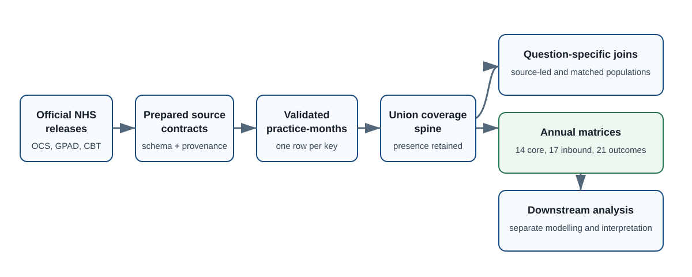
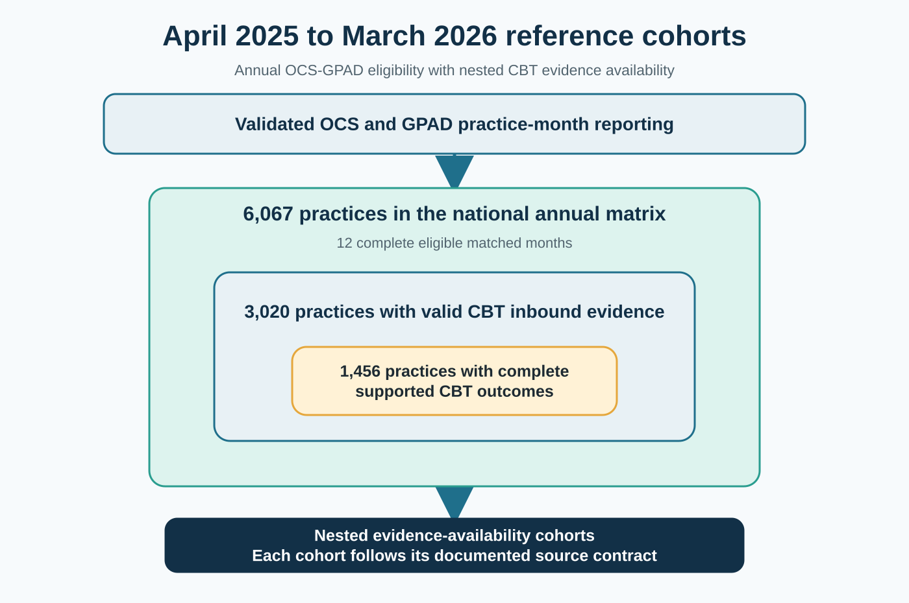

# PCADI: Primary Care Activity Data Integration

*A reproducible SQL and Python pipeline for integrating NHS England primary-care activity publications at practice-month level.*

[](https://github.com/PeterHDS/pcadi-data-integration/actions/workflows/validate.yml) [](LICENSE) [](sql/README.md)

PCADI prepares NHS England primary-care activity publications for reproducible analysis. The SQL and Python workflow aligns online-consultation, appointment, telephony and registered-patient data at practice-month level, preserves source coverage and missingness, and produces question-specific analytical tables with complete validation evidence.

This repository includes a verified April 2025 to March 2026 reference application and configurable synthetic demonstrations for other observation lengths. Each output records its source population, join logic, grain and interpretation scope.

```powershell
git clone https://github.com/PeterHDS/pcadi-data-integration.git
cd pcadi-data-integration
python automation/pipeline_cli.py demo --months 3
```



## Contents

- [Start here](#start-here)
- [What PCADI provides](#what-pcadi-provides)
- [Choose an analytical design](#choose-an-analytical-design)
- [Build a selected period](#build-a-selected-period)
- [Inspect the verified reference application](#inspect-the-verified-reference-application)
- [Validate an output](#validate-an-output)
- [Evidence base and design input](#evidence-base-and-design-input)
- [Interpretation scope](#interpretation-scope)
- [Project architecture and downstream use](#project-architecture-and-downstream-use)
- [Guides by reader](#guides-by-reader)
- [Repository structure](#repository-structure)
- [Citation, contact and reuse](#citation-contact-and-reuse)

## Start here

| Goal | Route |
|---|---|
| Understand the workflow | [Project architecture](docs/PROJECT_ARCHITECTURE.md) |
| Run the pipeline without NHS data | [Synthetic demonstration](examples/synthetic/README.md) |
| Obtain the official files for an analytical period | [Official NHS data guide](docs/get-official-nhs-data/README.md) |
| Build a selected period | [Period configuration](docs/PERIOD_CONFIGURATION.md) |
| Select a join for a research question | [Analytical design index](docs/analytical-designs/README.md) |
| Inspect the included annual outputs | [Verified reference application](docs/reference-applications/apr2025-mar2026.md) |
| Verify schemas, counts and file integrity | [Validation method](docs/VALIDATION_METHOD.md) |
| Follow a task from inputs to evidence | [Practical use cases](docs/PRACTICAL_USE_CASES.md) |

Install [Python 3.11 or newer](https://www.python.org/downloads/) before running the demonstration. On Windows, `RUN_DEMO.cmd` provides the same entry point. The run creates deterministic synthetic inputs, executes the SQL and writes validation evidence under `work/demo_3_months/outputs/`.

## What PCADI provides

PCADI first creates validated source tables with one row per standardised practice code and reporting month. It then provides:

- source-led views that retain the reporting population of a selected publication family;
- coverage views that preserve reported and absent source keys;
- matched views with explicit common populations;
- a union practice-month spine for OCS, GPAD and CBT coverage;
- annual practice matrices for exactly twelve complete eligible months;
- source provenance, cardinality checks, missingness evidence and deterministic fingerprints; and
- compact reference outputs for independent inspection.

OCS submissions, GPAD appointments and CBT calls remain distinct operational measures. Registered-patient counts provide monthly practice-size denominators under documented rate contracts. ODS practice codes provide the organisational linkage key.

## Choose an analytical design

Each design retains the population required by its analytical question, so output size varies deliberately across joins.

### Source-led and coverage views

| Question | Retained population | Grain | Sources | Output |
|---|---|---|---|---|
| What appointment context is available for OCS records? | OCS-reported keys | Practice-month | OCS, GPAD | `online_consultation_led_appointment_alignment` |
| What OCS context is available for appointment records? | GPAD-reported keys | Practice-month | GPAD, OCS | `appointment_led_online_consultation_alignment` |
| Where does each activity source report? | Union of reported source keys | Practice-month | OCS, GPAD, CBT | `multichannel_practice_month_coverage` |

### Matched activity views

| Question | Retained population | Grain | Sources | Output |
|---|---|---|---|---|
| How do OCS and GPAD compare where both report? | Matched OCS-GPAD keys | Practice-month | OCS, GPAD | `matched_online_and_scheduled_activity` |
| What evidence is available where all three sources match? | Matched OCS-GPAD keys with valid CBT | Practice-month | OCS, GPAD, CBT | `matched_multichannel_activity` |
| How do OCS-GPAD patterns look within the CBT-observed population? | CBT-observed matched keys | Practice-month | OCS, GPAD, CBT | `telephony_observed_comparative_cohort` |

### Annual practice matrices

| Question | Retained population in the reference application | Grain | Sources | Output |
|---|---:|---|---|---|
| What is each eligible practice's annual OCS-GPAD activity profile? | 6,067 practices | Practice | OCS, GPAD, registered patients | `primary_practice_access_clustering_matrix.csv` |
| What CBT inbound evidence extends the annual profile? | 3,020 nested practices | Practice | OCS, GPAD, CBT | `cbt_inbound_sensitivity_clustering_matrix_17_features.csv` |
| What complete CBT outcomes extend the annual profile? | 1,456 nested practices | Practice | OCS, GPAD, CBT | `cbt_outcomes_sensitivity_clustering_matrix_21_features.csv` |

### Supplementary timing view

| Question | Retained population | Grain | Sources | Output |
|---|---|---|---|---|
| How are OCS and CBT records distributed within the week? | Eligible timing records | Practice and timing bucket | OCS, CBT | Supplementary temporal outputs |

The [analytical design index](docs/analytical-designs/README.md) records the required files, join key, retained population, evidence, selection consideration and validation route for every design.

## Build a selected period

PCADI accepts a positive number of consecutive months when compatible official source files are prepared. Create a configuration and a source checklist:

```powershell
python automation/pipeline_cli.py make-config `
  --start 2026-03 --months 3 `
  --output configs/my_period.json

python automation/pipeline_cli.py data-checklist `
  --config configs/my_period.json `
  --output work/my_period_data_checklist.csv
```

After preparing the four contract-controlled inputs, run:

```powershell
python automation/pipeline_cli.py run `
  --config configs/my_period.json `
  --input-dir data/prepared `
  --output-dir work/my_period_output `
  --database work/my_period.sqlite `
  --overwrite
```

Use the [official NHS data guide](docs/get-official-nhs-data/README.md) and [`contracts/sources`](contracts/sources) to prepare the inputs. One-, three-, twelve- and twenty-four-month synthetic runs exercise the configurable practice-month branch. The annual matrix branch activates for exactly twelve complete eligible months.

## Inspect the verified reference application

The April 2025 to March 2026 application includes three annual analytical contracts:

| Matrix | Practices | Numerical features | Role |
|---|---:|---:|---|
| [National annual OCS-GPAD matrix](outputs/primary_practice_access_clustering_matrix.csv) | 6,067 | 14 | National annual reference matrix |
| [CBT inbound restricted cohort](outputs/cbt_inbound_sensitivity_clustering_matrix_17_features.csv) | 3,020 | 17 | Nested telephony evidence matrix |
| [CBT outcome-complete restricted cohort](outputs/cbt_outcomes_sensitivity_clustering_matrix_21_features.csv) | 1,456 | 21 | Nested outcome-complete evidence matrix |

The national matrix retains the published GPAD `1 day` and `2 to 7 days` booking bands as separate features. The CBT matrices inherit every shared parent value exactly after practice-code alignment. The practice identifier remains attached for traceability and is excluded from numerical modelling inputs.

Schemas, dimensions and [SHA-256 checksums](validation/authoritative_output_manifest.csv) lock these contracts. The [reference application guide](docs/reference-applications/apr2025-mar2026.md) documents sources, cohort nesting, validation and interpretation scope.



## Validate an output

Run the compact reference validation:

```powershell
python automation/pipeline_cli.py validate-reference `
  --restore-missing `
  --output work/reference_validation.csv
```

On Windows, `RUN_REFERENCE_VALIDATION.cmd` performs the same check. Release-only CSVs are restored after the archive filename, byte size and checksum pass, then all fourteen registered reference outputs are checked against the output register. A selected-period run records its own mandatory gates in `pipeline_validation_results.csv`.

## Evidence base and design input

PCADI links each public measure to official NHS England definitions, publication provenance and an explicit role in the pipeline. Research on online consultation, appointment patterns, access systems and routinely collected data informed the interpretation contract. Reproducible analytical pipeline guidance informed the separation of source contracts, SQL stages, configuration and validation.

Informal, non-attributable discussions with professionals working in Integrated Care Board and NHS England settings sharpened the operational questions considered during development. Published numerical outputs derive from the documented public datasets. See [Evidence base and references](docs/EVIDENCE_BASE_AND_REFERENCES.md).

## Interpretation scope

PCADI describes recorded practice activity, reporting coverage and source availability. OCS, GPAD and CBT remain separate operational measures. Registered-patient counts provide month-matched practice-size denominators. Workforce, patient experience, deprivation, quality, safety and outcomes are separate analytical domains requiring their own evidence.

Missing records preserve their source-specific meaning and remain distinct from observed zero activity. Downstream profiles describe recurring activity configurations and should be interpreted with assignment uncertainty and source context. The [responsible-use page](docs/PROJECT_CONTEXT_AND_RESPONSIBLE_USE.md) and [source catalogue](docs/SOURCE_CATALOGUE.md) provide the full measure-level scope.

## Project architecture and downstream use

PCADI's responsibility ends with prepared sources, SQL integration, cohort construction, validated feature matrices, provenance and reference-output validation. Model selection, clustering, profile interpretation, sensitivity testing, temporal robustness, external contextual analysis and visual reporting are downstream analytical activities.

The matrices support clustering, descriptive analysis and linkage to independently governed context datasets. See [Project architecture](docs/PROJECT_ARCHITECTURE.md) for the complete boundary and data flow.

## Guides by reader

| Reader | Guide |
|---|---|
| Examiner or academic reviewer | [Research and reference-output inspection](docs/audiences/examiner-guide.md) |
| NHS or ICB analyst | [Build and select a period-specific output](docs/audiences/analyst-guide.md) |
| Learner | [Guided synthetic tutorial](docs/audiences/learner-tutorial.md) |
| Technical reviewer | [Contracts, tests and integrity gates](docs/audiences/technical-reviewer.md) |
| Maintainer | [Source and output contract maintenance](docs/audiences/maintainer-guide.md) |

## Repository structure

| Location | Purpose |
|---|---|
| [`sql/portable`](sql/portable) | Configurable practice-month and annual SQL |
| [`sql/core_pipeline`](sql/core_pipeline) | Ordered SQL for the verified reference application |
| [`automation`](automation) | Standard-library Python orchestration and checks |
| [`contracts`](contracts) | Prepared-source and output interfaces |
| [`docs`](docs) | Concepts, analytical designs, source acquisition and reader guides |
| [`reference-release`](reference-release) | Frozen reference lineage and validation evidence |
| [`outputs`](outputs) | Compact verified reference outputs |
| [`validation`](validation) | Machine-readable checksums and gates |
| [`tests`](tests) | Deterministic regression and documentation checks |

Raw NHS downloads and local working databases remain outside Git.

## Citation, contact and reuse

Use [CITATION.cff](CITATION.cff) to cite PCADI, then cite the exact official source publications used for the selected period, the downstream analytical method and the associated study where findings are reused. The [evidence and references page](docs/EVIDENCE_BASE_AND_REFERENCES.md) gives the complete citation route.

Use [GitHub Issues](https://github.com/PeterHDS/pcadi-data-integration/issues) for reproducibility or methodological questions. The maintainer identity is recorded in [CITATION.cff](CITATION.cff), contributions are described in [the contribution guide](.github/CONTRIBUTING.md), and the code is released under the [MIT licence](LICENSE).
